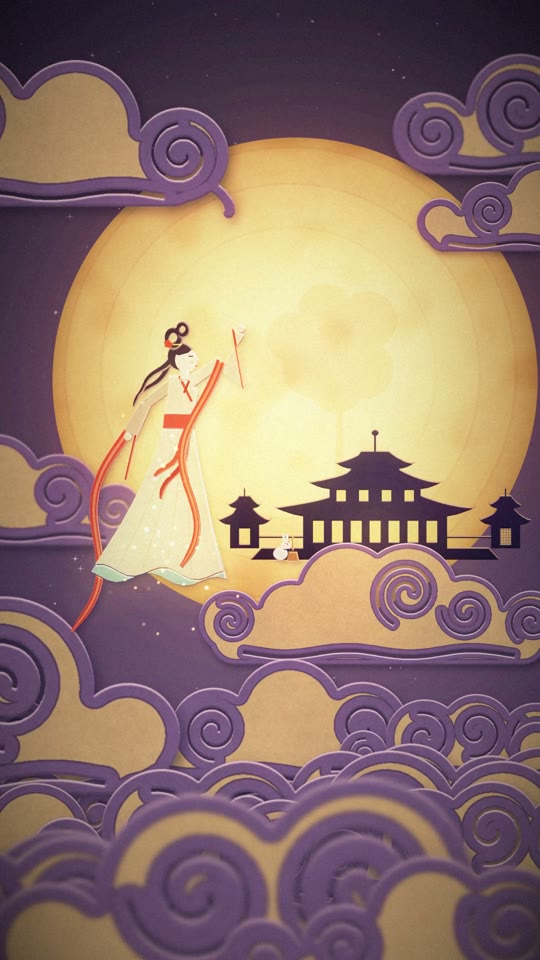
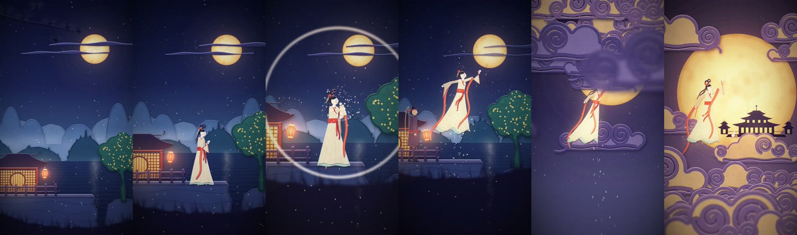

# 嫦娥奔月 · Chang'e Flies to the Moon

A 20-second vertical short film (9:16) of the Chinese myth of Chang'e. Every frame is drawn by code, and the soundtrack is synthesized too. There are no external images, footage or audio files.

<p align="center">
  
</p>



## Watch

| File | Specs | Size |
|---|---|---|
| [`Chang-e-Flies-to-the-Moon.mp4`](chang-e/Chang-e-Flies-to-the-Moon.mp4) | 1080×1920, 30 fps, 20 s, H.264 High + AAC 192k | 64 MB |
| [`Chang-e-Flies-to-the-Moon-preview.mp4`](chang-e/Chang-e-Flies-to-the-Moon-preview.mp4) | 720×1280, 30 fps, 20 s, H.264 + AAC 160k (mobile) | 11 MB |

Both files use `yuv420p` and `+faststart`, so they play directly on iPhone, Android and in browsers.

## Story

| Time | Beat |
|---|---|
| 0–4 s | **The world.** The camera tilts down from a moon veiled by wisps of cloud, past layered karst mountains and a lake, to a hillside pavilion. Lanterns sway, osmanthus petals drift, and a foreground pine branch slides out of frame. |
| 4–8 s | **Chang'e appears.** She glides out of the pavilion, lit from behind by its round lattice window. In her hands the elixir glows. She looks up at the moon and hesitates. |
| 8–12 s | **The elixir.** She swallows it: a shockwave ring and a burst of gold sparks. She lifts off, her ribbons unfurling. Hou Yi runs onto the terrace and reaches after her. |
| 12–16 s | **The ascent (climax).** She rushes up through layers of auspicious clouds, some passing in front of her. The moon swells, light rays appear and the palette shifts from night indigo to violet-gold. |
| 16–20 s | **Arrival.** The full moon fills the frame with the Moon Palace silhouette (its windows lit by the moon) and the Jade Rabbit at work. Chang'e reaches toward the moon as the motion slows to a still ending frame. |

## Art direction

The style is **layered paper-cut (紙雕) Eastern fantasy**. Every element is a cut-paper layer with fiber texture, a drop shadow onto the layers behind, a rim light on its top edges and a two-tone inner layer. The foreground layers are blurred for depth of field.

| Role | Colors |
|---|---|
| Main | Night indigo `#18204c` |
| Secondary | Jade mist `#2d6a62`, ivory paper `#e2d6bd` |
| Accent | Cinnabar `#cc3a33` (ribbons, lanterns, sash) |
| Light | Warm moon gold `#fbeac4` → `#e8b464`, lantern orange |
| Shadow | Violet-black `#0b0920` |

## Sound

Everything is synthesized in [`audio.py`](chang-e/audio.py) (48 kHz stereo):

- **Music:** D yu-mode pentatonic (D F G A C). It uses guzheng-like additive plucks with press bends, vibrato and glissandi, a dizi-like flute line, an evolving pad, bells and a building drum pattern.
- **Ambience:** night wind, lapping water and insects.
- **Effects:** a boom and bell when she swallows the elixir, a riser and whooshes during the ascent, and a temple bell on arrival.
- **Mix:** synthetic convolution reverb. About −15 LUFS integrated loudness, −1.5 dBFS true peak, with a 2-second fade-out.

## How it's made

The renderer is [`render.py`](chang-e/render.py), built on Python, NumPy, Pillow and SciPy:

1. **Build the assets once per worker.** All shapes are drawn as 2× supersampled vector masks: mountains, the lake, the pavilion, the tree, clouds, the moon and the palace. Each mask then becomes a paper sprite.
2. **Run a camera rig and a timeline.** The camera has a 2.5D parallax system: each layer has a depth factor `p` that sets how far it pans and zooms. The camera moves on eased keyframes and follows Chang'e during the ascent.
3. **Draw the characters fresh each frame.** Chang'e, Hou Yi and the rabbit are rebuilt from articulated polygons. The ribbons, sleeves, hair and skirt hem are driven by wave functions whose phases are integrated over time, so the motion never jumps when its speed changes.
4. **Composite and post-process each frame.** Effects are added in this order:
   - additive glows
   - particles with motion blur
   - bloom
   - radial light rays
   - tone mapping
   - vignette
   - film grain
5. **Encode.** All 600 frames are rendered in parallel and piped as raw video into FFmpeg (libx264).

### Reproduce

You need Python 3.11+ and FFmpeg on your `PATH`. Run these from `chang-e/`:

```bash
pip install numpy pillow scipy
```

```bash
mkdir -p build && python audio.py build/soundtrack.wav
```

```bash
NPROC=7 python render.py video build/video_master.mp4
```

```bash
ffmpeg -i build/video_master.mp4 -i build/soundtrack.wav -map 0:v -map 1:a -c:v libx264 -preset slow -crf 18 -profile:v high -level 4.2 -pix_fmt yuv420p -r 30 -c:a aac -b:a 192k -ar 48000 -movflags +faststart -shortest Chang-e-Flies-to-the-Moon.mp4
```

The render takes about 4 minutes on 8 cores. To preview single frames, run `python render.py test 0 9.1 19.97`; the frames are written to `chang-e/frames/`.
